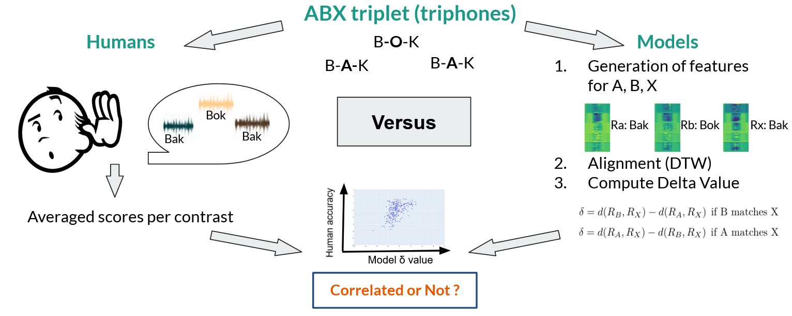

---
permalink: /
title: " "
excerpt: "About me"
author_profile: true
redirect_from: 
  - /about/
  - /about.html
--- 

Welcome ! I am a Student in Machine Learning, just graduated from the ENS (Ecole Normale Supérieure) Paris-Saclay and Ecole des Ponts ParisTech with an MSc. in Applied Mathematics, Deep Learning and Computer Vision (**Master MVA**). 

Previously I have done various research internships in Computer Vision. The latest one was in Valeo.ai where I was supervised by [Patrick Perez](http://ptrckprz.github.io): my research focused on developping Driver Monitoring Sytems throuch the analysis of the driver with 3D Pose Estimation.

<b>I am looking for a 4 to 5-6 months research internship in the field of Vision and Language/Speech models. I am open to work in any place, especially in the UK, Korea, Japan, Northern Europ, Canada and the US.</b>

You can also file in details the courses I followed during my master [here](https://victoria-brami.github.io/courses/)

Selected Projects
======
Here are some examples of the projects I have carried out, don't hesitate to click [here](http://victoria-brami.github.io/hobbies/) for more!
There are more to come of course ;)

<head>

</head>

<body>
<date_title>2022</date_title>
  

      <a href="">
         <!-- Image is mandatory for publications -->
      </a>
      
      
<a href="https://victoria-brami.github.io">
      <papertitle>3D Pose Estimation for Driver Monitoring</papertitle></a> 
      Victoria Brami,  <strong>Patrick Pérez</strong>, Renaud Marlet and Souhaiel Khalfaoui. 
      <em>Valeo AI Research Internship Project</em>, April-September 2022 <strong>(Oral).</strong> 
      
 
      

<buttons id="toDemoButton" class="float-left submit-button" title="Each year, almost 20 000 people die in Europe's roads in car accidents. Driver's distraction account for 20% of them. We propose to investigate the best 3D Driver Realtime Pose Estimation for action recognition purpose and understand car passengers needs. This is an opportunity for the automotive industry since driver and interior monitoring systems (DMS and IMS), which require the detailed understanding of a car’s passengers typically with a single camera, are gaining more importance every day. Systems that detect driver’s drowsiness or distraction are already deployed in numerous vehicles, and will continue to expand as new laws make them mandatory.">Abstract</buttons>

<buttons id="toPdfButton" class="float-left submit-button" >Report</buttons>

<buttons id="toCodeButton" class="float-left submit-button" >Code</buttons>

   

      <a href="">
         <!-- Image is mandatory for publications -->
      </a>
      
      
<a href="https://victoria-brami.github.io">
      <papertitle>Face Inpainting with GANs: An ablation study</papertitle></a> 
      Victoria Brami, Claring Vongpaseut, <i>Supervised by Yann Gousseau</i>. 
      <em>MSc. Research Project</em>, Jan.-Feb. 2022 <strong>(Oral).</strong> 
       

    <buttons id="toPdfButton" class="float-left submit-button" >Report</buttons>
    

    
    

    <buttons id="toCodeButton" class="float-left submit-button" >Code</buttons>
    

    
      
 
      
  
<date_title>2021</date_title>
  

  

      
      
      
<a href="https://victoria-brami.github.io">
      <papertitle>Comparing Speech Models to Human Perception</papertitle></a> 
       Victoria Brami,  <strong>Juliette Millet</strong>, Ewan Dunbar and Emmanuel Dupoux 
      <em>CoML research project</em>, March-July 2021 <strong>(Oral)</strong> 
      
 
      

  

  <buttons id="toDemoButton" class="float-left submit-button" title="What happens in the brain when humans perceive speech? We lay the ground for a new and expansive field of research aimed at reproducing human speech perception behaviour, by developing easy-to-use reference data and evaluation tools. In short, just as the past half-century has developed and tested thousands of speech perception experiments on human listeners, we develop a set of 'speech perception experiments for machines,' in order to find and close the gap between human and machine.">Abstract</buttons>
  

  

  <buttons id="toPdfButton" class="float-left submit-button" >PDF</buttons>
  

  
  

  <buttons id="toCodeButton" class="float-left submit-button" >Code</buttons>
  

  
